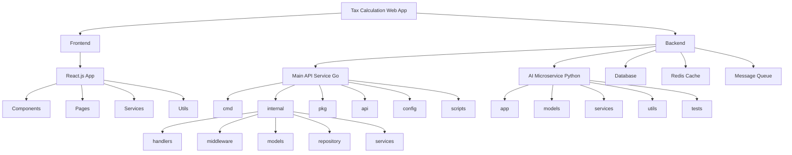

```mermaid
graph TD
    A[Tax Calculation Web App] --> B[Frontend]
    A --> C[Backend]
    
    B --> B1[React.js App]
    B1 --> B2[Components]
    B1 --> B3[Pages]
    B1 --> B4[Services]
    B1 --> B5[Utils]

    C --> D[Main API Service Go]
    C --> E[AI Microservice Python]

    D --> D1[cmd]
    D --> D2[internal]
    D --> D3[pkg]
    D --> D4[api]
    D --> D5[config]
    D --> D6[scripts]

    D2 --> D2A[handlers]
    D2 --> D2B[middleware]
    D2 --> D2C[models]
    D2 --> D2D[repository]
    D2 --> D2E[services]

    E --> E1[app]
    E --> E2[models]
    E --> E3[services]
    E --> E4[utils]
    E --> E5[tests]

    C --> F[Database]
    C --> G[Redis Cache]
    C --> H[Message Queue]
```